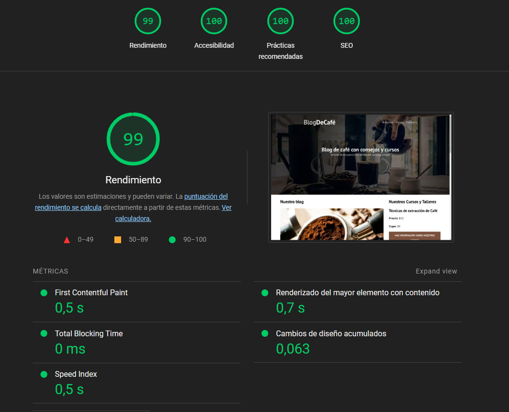

# Blog De Café

Link: [Blog de cafe](https://blogdecafeposta.netlify.app/)

Link del repo: [Repositorio en GitHub](https://github.com/fernandoD91/BlogDeCafe)
    
## Características Iniciales

- Fuentes:
    - Open Sans
    - PT Sans
- Uso de Reset/Reglas de CSS
    - [Normalize](https://necolas.github.io/normalize.css/)

- Metodologia de nomenclatura utilizada:
    - BEM (Block-Element-Modifier)

- Se agrego a las imagenes "loading="lazy" para mejorar el performance de la pagina.
    - < img loading="lazy">

- Uso de 'preload' para elementos que se requieren una carga rapida
    - ejemplo: `<link rel="preload" href="css/normalize.css" as="style">`

- Uso de 'prefetch' para cargar la pagina 'CURSOS' mas rapida ya que es la mas importante y solicitada.

- Uso de la etiqueta `<picture>` para la posibilidad de usar la imagen webp para reducir el tamaño de descarga y tambien agregamos la posibilidad de usar imagenes en format 'jpg' en caso de que el navegador NO soporte webp

- Uso de 'Modernizer para poder usar imagen en formato 'webp', en caso de no soportar usara 'jpg'
    - [modernizr](https://modernizr.com/download?webp-setclasses&q=webp)

- Uso de la etiqueta meta 'description' para un mejor SEO
    - `<meta name="description" content="Página web de blog de café">`

- Auditoria y deployment creada con LightHouse

